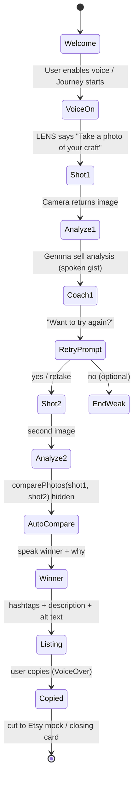

# My prompt and questions:

because - imaging if a blind / low vision is acceeing our L.E.N.S. web or PWA - how wil lthey interact with the coaching (uplaod photo and gemma analyzes) - but they have to click the uplaoder to          
  uplaod the photo, what if we can show in the demo that the blind artisan can go to the PWA and the iOS Native accessibiloity feature speaks out - click the Voice command mode (how to do this  or ios       
  will know what button to be clicked and it/s label?) -is says activate voive command , then the announcement form LENS thta voice command activated. Then iso accessibility says take a picture for your     
   craft (the camera opens) - then the user clicks it and it is in PWA app already and the analysis is triggered for gemma 4 (iof we connect the PWA locally via LAN/WAN Ip sharing on localhost then          
  ollama, or we cna use the ollama cloud we had integrated already and that wil return the same reposne and analysis), then voice (ios or maybe better - the LENS App : says - do you want to try again        
  and same if artisan says yes - the caemra opens and baseed on last analysis the blind artisan takes a better shot, then the auti-upload in LENS and gemma analysis - this time but we need to somehow        
  bring in the compare feature for the artisan mode in play without the user explicitly clicking in compare 2 photos), so now the analysis via gemma4 says - yes this photo is teh winner and ready to be      
  listed and then voice over about why it is better an dthen the hastags, peod desription ready to be copied), - user then copies them (ios voice over guiding the copy button) - then the user navigates      
  to etsy (not our app scpe but just to show that they use the photo and text copied for listing product on etsy)...then the product is listed and the demo vidoe concludes saying how LENS helped them        
  acheiveve independence and a quality photo locally, and private, secure and faster in their phone and pocket.....what do you think about this? can this be done? if yes - this will actually prove the       
  value of the product.. otherwise now it is bit hard to comprehend as all the website shows is a uplaoder (which again the ios accessibility can help the artisan to uplaod photos) - but then not like a     
   good story arc.... let plan this first design wose and then if good omplement. i guess w ehave time. todya is may 16 11 am CET, deadling is May 18th, so enough time...                                     
                                                                                                                                  # Claude plan:                                                                             
⏺ This is a brilliant demo concept! It transforms L.E.N.S. from "a photo uploader with voice" to "a life-changing independence tool for blind artisans."                                                       
                                                                                                                                                                                                               
  Let me plan this properly.                                                                                                                                                                                   
                                                                                                                                                                                                               
  ---                                                                                                                                                                                                          
  The Demo Story Arc                                                                                                                                                                                           
                                                                                                                                                                                                               
  ┌─────────────────────────────────────────────────────────────────────────────┐                                                                                                                              
  │                    L.E.N.S. Accessibility Demo Flow                         │                                                                                                                              
  ├─────────────────────────────────────────────────────────────────────────────┤                                                                                                                              
  │                                                                             │                                                                                                                              
  │  1. ENTRY                                                                   │                                                                                                                              
  │     └─→ Blind artisan opens L.E.N.S. PWA on iPhone                         │                                                                                                                               
  │     └─→ iOS VoiceOver: "L.E.N.S. Photography Coach. Activate Voice         │                                                                                                                               
  │                         Commands button"                                    │                                                                                                                              
  │                                                                             │                                                                                                                              
  │  2. ACTIVATION                                                              │                                                                                                                              
  │     └─→ User taps (VoiceOver guides)                                       │                                                                                                                               
  │     └─→ L.E.N.S. TTS: "Voice commands active. Say 'take photo' to begin"   │                                                                                                                               
  │                                                                             │                                                                                                                              
  │  3. FIRST CAPTURE                                                           │                                                                                                                              
  │     └─→ User: "Take photo"                                                 │                                                                                                                               
  │     └─→ L.E.N.S.: "Opening camera. Position your craft and say 'capture'" │                                                                                                                                
  │     └─→ User: "Capture"                                                    │                                                                                                                               
  │     └─→ *click* Photo taken                                                │                                                                                                                               
  │                                                                             │                                                                                                                              
  │  4. FIRST ANALYSIS                                                          │                                                                                                                              
  │     └─→ L.E.N.S.: "Analyzing your photo with Gemma..."                     │                                                                                                                               
  │     └─→ [Gemma 4 via Ollama Cloud]                                         │                                                                                                                               
  │     └─→ L.E.N.S.: "Your hand-knit scarf shows beautiful texture.          │                                                                                                                                
  │                    However, the lighting is uneven — the left side         │                                                                                                                               
  │                    is darker. Try moving closer to the window.             │                                                                                                                               
  │                    Say 'try again' to take another shot."                  │                                                                                                                               
  │                                                                             │                                                                                                                              
  │  5. RETRY FLOW (Auto-Compare Magic ✨)                                      │                                                                                                                              
  │     └─→ User: "Try again"                                                  │                                                                                                                               
  │     └─→ L.E.N.S.: "Opening camera. Apply the suggestion: move closer      │                                                                                                                                
  │                    to the window. Say 'capture' when ready."               │                                                                                                                               
  │     └─→ User: "Capture"                                                    │                                                                                                                               
  │     └─→ *click* Second photo taken                                         │                                                                                                                               
  │     └─→ L.E.N.S.: "Comparing both photos..."                               │                                                                                                                               
  │                                                                             │                                                                                                                              
  │  6. WINNER DECLARED                                                         │                                                                                                                              
  │     └─→ L.E.N.S.: "Photo 2 is the winner! The lighting is now even,       │                                                                                                                                
  │                    and the texture detail is much clearer. This photo      │                                                                                                                               
  │                    is marketplace-ready. Say 'get listing' for your        │                                                                                                                               
  │                    product description and hashtags."                       │                                                                                                                              
  │                                                                             │                                                                                                                              
  │  7. LISTING COPY                                                            │                                                                                                                              
  │     └─→ User: "Get listing"                                                │                                                                                                                               
  │     └─→ L.E.N.S.: "Your listing is ready. Title: Hand-knit wool scarf     │                                                                                                                                
  │                    in natural cream. Description: [reads it]. Hashtags:    │                                                                                                                               
  │                    handmade, knitting, wool, artisan. Say 'copy' to        │                                                                                                                               
  │                    copy to clipboard."                                      │                                                                                                                              
  │     └─→ User: "Copy"                                                       │                                                                                                                               
  │     └─→ L.E.N.S.: "Copied! Open Etsy and paste in your listing."          │                                                                                                                                
  │                                                                             │                                                                                                                              
  │  8. DEMO CONCLUSION                                                         │                                                                                                                              
  │     └─→ [Screen shows Etsy with listing pasted]                            │                                                                                                                               
  │     └─→ Narrator: "With L.E.N.S., blind and low-vision artisans can       │                                                                                                                                
  │                    independently photograph, analyze, and list their       │                                                                                                                               
  │                    handmade goods — privately, locally, at zero cost."     │                                                                                                                               
  │                                                                             │                                                                                                                              
  └─────────────────────────────────────────────────────────────────────────────┘                                                                                                                              
                                                                                                                                                                                                               
  ---                                                                                                                                                                                                          
  Technical Implementation Plan                                                                                                                                                                                
                                                                                                                                                                                                               
  What We Need to Build                                                                                                                                                                                        
  ┌──────────────────────────┬────────────┬──────┬─────────────────────────────────────────────────────┐                                                                                                       
  │        Component         │ Complexity │ Time │                     Description                     │                                                                                                       
  ├──────────────────────────┼────────────┼──────┼─────────────────────────────────────────────────────┤                                                                                                       
  │ 1. Accessibility Markup  │ Easy       │ 2h   │ aria-labels, roles, aria-live regions for VoiceOver │                                                                                                       
  ├──────────────────────────┼────────────┼──────┼─────────────────────────────────────────────────────┤                                                                                                       
  │ 2. STT Command System    │ Medium     │ 3h   │ Web Speech Recognition with 6 commands              │                                                                                                       
  ├──────────────────────────┼────────────┼──────┼─────────────────────────────────────────────────────┤                                                                                                       
  │ 3. Voice Flow Controller │ Medium     │ 3h   │ State machine orchestrating the flow                │                                                                                                       
  ├──────────────────────────┼────────────┼──────┼─────────────────────────────────────────────────────┤                                                                                                       
  │ 4. Auto-Compare Logic    │ Easy       │ 2h   │ Store photo A, auto-compare on photo B              │                                                                                                       
  ├──────────────────────────┼────────────┼──────┼─────────────────────────────────────────────────────┤                                                                                                       
  │ 5. Camera Voice Control  │ Medium     │ 2h   │ Voice-triggered capture                             │                                                                                                       
  ├──────────────────────────┼────────────┼──────┼─────────────────────────────────────────────────────┤                                                                                                       
  │ 6. Copy to Clipboard     │ Easy       │ 30m  │ Already exists, just voice-trigger                  │                                                                                                       
  ├──────────────────────────┼────────────┼──────┼─────────────────────────────────────────────────────┤                                                                                                       
  │ 7. Testing & Polish      │ Medium     │ 2h   │ iOS VoiceOver testing                               │                                                                                                       
  ├──────────────────────────┼────────────┼──────┼─────────────────────────────────────────────────────┤                                                                                                       
  │ Total                    │            │ ~14h │ Achievable by May 18                                │                                                                                                       
  └──────────────────────────┴────────────┴──────┴─────────────────────────────────────────────────────┘                                                                                                       
  ---                                                                                                                                                                                                          
  iOS VoiceOver Integration (Free!)                                                                                                                                                                            
                                                                                                                                                                                                               
  VoiceOver reads aria-label automatically. We just need proper markup:                                                                                                                                        
                                                                                                                                                                                                               
  // Voice Command Button - VoiceOver will read this                                                                                                                                                           
  <button                                                                                                                                                                                                      
    aria-label="Activate Voice Commands. Double-tap to enable hands-free control."                                                                                                                             
    role="button"                                                                                                                                                                                              
    className="..."                                                                                                                                                                                            
    onClick={activateVoiceMode}                                                                                                                                                                                
  >                                                                                                                                                                                                            
    <Mic /> Voice Commands                                                                                                                                                                                     
  </button>                                                                                                                                                                                                    
                                                                                                                                                                                                               
  // Live announcements - VoiceOver reads these automatically                                                                                                                                                  
  
                                                                                                                                                                                                            
    {announcement} {/* "Voice commands active. Say help for options." */}                                                                                                                                      
  
                                                                                                                                                                                                       
                                                                                                                                                                                                               
  ---                                                                                                                                                                                                          
  Voice Command State Machine                                                                                                                                                                                  
                                                                                                                                                                                                               
                      ┌──────────────┐                                                                                                                                                                         
                      │     IDLE     │                                                                                                                                                                         
                      └──────┬───────┘                                                                                                                                                                         
                             │ "activate voice"                                                                                                                                                                
                             ▼                                                                                                                                                                                 
                      ┌──────────────┐                                                                                                                                                                         
                      │ VOICE_ACTIVE │◄─────────────────┐                                                                                                                                                      
                      └──────┬───────┘                  │                                                                                                                                                      
                             │ "take photo"             │                                                                                                                                                      
                             ▼                          │                                                                                                                                                      
                      ┌──────────────┐                  │                                                                                                                                                      
                      │   CAMERA     │                  │                                                                                                                                                      
                      └──────┬───────┘                  │                                                                                                                                                      
                             │ "capture"                │                                                                                                                                                      
                             ▼                          │                                                                                                                                                      
                      ┌──────────────┐                  │                                                                                                                                                      
                      │  ANALYZING   │                  │                                                                                                                                                      
                      └──────┬───────┘                  │                                                                                                                                                      
                             │ analysis complete        │                                                                                                                                                      
                             ▼                          │                                                                                                                                                      
                      ┌──────────────┐                  │                                                                                                                                                      
                      │   RESULTS    │                  │                                                                                                                                                      
                      └──────┬───────┘                  │                                                                                                                                                      
                             │                          │                                                                                                                                                      
                ┌────────────┼────────────┐             │                                                                                                                                                      
                │ "try again"│            │ "done"      │                                                                                                                                                      
                ▼            │            ▼             │                                                                                                                                                      
         ┌────────────┐      │     ┌────────────┐       │                                                                                                                                                      
         │  CAMERA_2  │      │     │   LISTING  │       │                                                                                                                                                      
         └──────┬─────┘      │     └──────┬─────┘       │                                                                                                                                                      
                │ "capture"  │            │ "copy"      │                                                                                                                                                      
                ▼            │            ▼             │                                                                                                                                                      
         ┌────────────┐      │     ┌────────────┐       │                                                                                                                                                      
         │  COMPARING │      │     │   COPIED   │───────┘                                                                                                                                                      
         └──────┬─────┘      │     └────────────┘                                                                                                                                                              
                │            │                                                                                                                                                                                 
                ▼            │                                                                                                                                                                                 
         ┌────────────┐      │                                                                                                                                                                                 
         │   WINNER   │──────┘                                                                                                                                                                                 
         └────────────┘  "get listing"                                                                                                                                                                         
                                                                                                                                                                                                               
  ---                                                                                                                                                                                                          
  Voice Commands to Implement                                                                                                                                                                                  
  ┌─────────────────────┬────────────────────────────────┬──────────────────────────┐                                                                                                                          
  │       Command       │            Aliases             │          Action          │                                                                                                                          
  ├─────────────────────┼────────────────────────────────┼──────────────────────────┤                                                                                                                          
  │ "take photo"        │ "capture photo", "open camera" │ Opens camera             │                                                                                                                          
  ├─────────────────────┼────────────────────────────────┼──────────────────────────┤                                                                                                                          
  │ "capture"           │ "take", "snap", "click"        │ Takes the photo          │                                                                                                                          
  ├─────────────────────┼────────────────────────────────┼──────────────────────────┤                                                                                                                          
  │ "yes" / "try again" │ "retry", "another"             │ Retry flow with compare  │                                                                                                                          
  ├─────────────────────┼────────────────────────────────┼──────────────────────────┤                                                                                                                          
  │ "no" / "done"       │ "finished", "stop"             │ Move to listing          │                                                                                                                          
  ├─────────────────────┼────────────────────────────────┼──────────────────────────┤                                                                                                                          
  │ "get listing"       │ "listing", "description"       │ Generate listing text    │                                                                                                                          
  ├─────────────────────┼────────────────────────────────┼──────────────────────────┤                                                                                                                          
  │ "copy"              │ "copy text", "clipboard"       │ Copy to clipboard        │                                                                                                                          
  ├─────────────────────┼────────────────────────────────┼──────────────────────────┤                                                                                                                          
  │ "help"              │ "commands", "what can I say"   │ List available commands  │                                                                                                                          
  ├─────────────────────┼────────────────────────────────┼──────────────────────────┤                                                                                                                          
  │ "repeat"            │ "say again", "what"            │ Repeat last announcement │                                                                                                                          
  └─────────────────────┴────────────────────────────────┴──────────────────────────┘                                                                                                                          
  ---                                                                                                                                                                                                          
  Files to Create/Modify                                                                                                                                                                                       
                                                                                                                                                                                                               
  services/                                                                                                                                                                                                    
    └── voiceCommandService.ts    [NEW] - STT recognition + command parsing                                                                                                                                    
    └── voiceFlowController.ts    [NEW] - State machine for demo flow                                                                                                                                          
    └── voiceCoach.ts             [MODIFY] - Add announcement queue                                                                                                                                            
                                                                                                                                                                                                               
  components/                                                                                                                                                                                                  
    └── VoiceCommandOverlay.tsx   [NEW] - Visual feedback + status                                                                                                                                             
    └── SellMode.tsx              [MODIFY] - Integrate voice flow                                                                                                                                              
    └── AccessibilityAnnouncer.tsx [NEW] - aria-live region component                                                                                                                                          
                                                                                                                                                                                                               
  ---                                                                                                                                                                                                          
  Demo Video Script (30-60 seconds)                                                                                                                                                                            
                                                                                                                                                                                                               
  [Screen: iPhone with L.E.N.S. PWA]                                                                                                                                                                           
                                                                                                                                                                                                               
  NARRATOR: "Meet Sarah, a blind artisan who knits handmade scarves."                                                                                                                                          
                                                                                                                                                                                                               
  [VoiceOver: "L.E.N.S. Photography Coach"]                                                                                                                                                                    
                                                                                                                                                                                                               
  NARRATOR: "With L.E.N.S., she photographs her products independently."                                                                                                                                       
                                                                                                                                                                                                               
  SARAH: "Take photo."                                                                                                                                                                                         
  L.E.N.S.: "Opening camera. Say capture when ready."                                                                                                                                                          
  SARAH: "Capture."                                                                                                                                                                                            
  [Camera shutter sound]                                                                                                                                                                                       
                                                                                                                                                                                                               
  L.E.N.S.: "Your scarf shows beautiful texture, but lighting is uneven.                                                                                                                                       
            Try moving closer to the window. Say 'try again' for another shot."                                                                                                                                
                                                                                                                                                                                                               
  SARAH: "Try again."                                                                                                                                                                                          
  [Second capture]                                                                                                                                                                                             
                                                                                                                                                                                                               
  L.E.N.S.: "Photo 2 is the winner! Lighting is even, texture is clear.                                                                                                                                        
            Say 'get listing' for your product description."                                                                                                                                                   
                                                                                                                                                                                                               
  SARAH: "Get listing."                                                                                                                                                                                        
  L.E.N.S.: "Hand-knit wool scarf in natural cream. Hashtags: handmade,                                                                                                                                        
            knitting, artisan. Say 'copy' to copy."                                                                                                                                                            
                                                                                                                                                                                                               
  SARAH: "Copy."                                                                                                                                                                                               
  L.E.N.S.: "Copied! Open Etsy to paste your listing."                                                                                                                                                         
                                                                                                                                                                                                               
  [Screen: Etsy listing with photo and text pasted]                                                                                                                                                            
                                                                                                                                                                                                               
  NARRATOR: "L.E.N.S. — Local, private, voice-guided photography coaching.                                                                                                                                     
             Independence in your pocket."                                                                                                                                                                     
                                                                                                                                                                                                               
  ---                                                                                                                                                                                                          
  My Assessment                                                                                                                                                                                                
  ┌───────────────────┬───────────────────────────────────────────────┐                                                                                                                                        
  │     Question      │                    Answer                     │                                                                                                                                        
  ├───────────────────┼───────────────────────────────────────────────┤                                                                                                                                        
  │ Can this be done? │ ✅ Yes, absolutely                            │                                                                                                                                        
  ├───────────────────┼───────────────────────────────────────────────┤                                                                                                                                        
  │ Time available    │ ~50 hours (May 16 11am → May 18 midnight CET) │                                                                                                                                        
  ├───────────────────┼───────────────────────────────────────────────┤                                                                                                                                        
  │ Time needed       │ ~14-16 hours                                  │                                                                                                                                        
  ├───────────────────┼───────────────────────────────────────────────┤                                                                                                                                        
  │ Risk level        │ Low — Web Speech API is well-supported        │                                                                                                                                        
  ├───────────────────┼───────────────────────────────────────────────┤                                                                                                                                        
  │ Demo impact       │ 🔥 MASSIVE — This is a winning demo           │                                                                                                                                        
  └───────────────────┴───────────────────────────────────────────────┘                                                                                                                                        
  ---                                                                                                                                                                                                          
  Next Steps                                                                                                                                                                                                   
                                                                                                                                                                                                               
  1. Confirm the plan — Does this flow match your vision?                                                                                                                                                      
  2. Start with STT service — Core voice recognition                                                                                                                                                           
  3. Build state machine — Flow controller                                                                                                                                                                     
  4. Add accessibility markup — VoiceOver support                                                                                                                                                              
  5. Integrate into SellMode — Wire it all together                                                                                                                                                            
  6. Test on iOS — VoiceOver + voice commands                                                                                                                                                                  
  7. Record demo video — The story arc above                                                                                                                                                                   
                                                                                                                                                                                                               
  Should I start implementing? I'd begin with voiceCommandService.ts for the STT foundation.                                                                                                                   
                                                                                                                                                                                                               
✻ Cogitated for 1m 17s                                  

**Cursor plan:**
**Short answer: yes — this is the right story, and most of it is buildable by May 18.** You already have ~60% of the plumbing; what’s missing is a **guided session** that stitches camera → analyze → retake → **silent compare** → winner + listing copy into one arc, instead of asking the judge to discover tabs and buttons.

---

## Why this idea is strong

Judges see “upload + scores” and think *another photo tool*. Your arc answers the real question:

> *Can a blind/low-vision artisan go from pocket → shot → coaching → better shot → listing text → Etsy, without sighted help and without sending photos to the cloud?*

That’s a **product story**, not a feature tour. It also matches what you’ve already positioned: **Artisan Studio** (`SellMode`), **voice** (`voiceCoach.ts`), **camera on mobile** (`capture="environment"`), and **compare** (`comparePhotos` in `ollamaService.ts`).

---

## What iOS can actually do (important split)

| Layer | What it does | For your demo |
|--------|----------------|----------------|
| **VoiceOver** | Reads visible controls using `aria-label` / accessible name | **Primary path.** User swipes to “Voice ON”, “Take product photo”, “Copy listing text”. Reliable if labels are clear and focus order is logical. |
| **Voice Control** (iOS) | User-defined commands like “Tap Voice” | **Optional flourish.** Works when the button’s spoken name matches what the user trained. You **cannot** assume judges have custom commands pre-configured. |
| **Safari Web Speech (STT)** | In-app “say take photo” | You already have this in `VoiceMode` via `startListening` → `onCapture`. On iOS it usually needs a **user tap** to start the mic (browser security). |
| **L.E.N.S. TTS** (`speechSynthesis`) | App speaks coaching | **Your differentiator.** “Voice coaching activated”, “Analyzing…”, “Photo B wins because…”. Use `aria-live` for the same text VoiceOver users might miss. |

**Reality check:** The browser **cannot** open the camera with zero user action. Even with `capture="environment"`, something must activate the hidden file input (tap, VoiceOver “double-tap”, Voice Control “tap …”, or your in-app voice command after mic is enabled). That’s normal and still demo-worthy — the story is *“I didn’t need a sighted person to find Compare or read tiny scores.”*

---

## What you already have vs what to add

**Already there**

- **Artisan Studio** with camera upload, voice toggle, sell analysis, copy fields (`SellMode.tsx`).
- **Voice Mode** with mobile camera, TTS, and command parsing (`capture` / `repeat` / `help`) (`VoiceMode.tsx`, `voiceCoach.ts`).
- **Compare API** — `comparePhotos(A, B)` returns `{ winner, reason }` (`ollamaService.ts`).
- **Compare UI** — manual two-slot upload in `App.tsx` / demo compare in `SellMode` (currently **user must opt in**).

**Missing for your arc**

1. **Session state machine** — hold shot 1 in memory; after analysis, ask “Try again?”; on yes, shot 2 → **auto-compare** (no Compare tab).
2. **Single “Demo journey” entry** — one big primary action: *Start voice-guided listing* (not samples + upload + compare).
3. **Spoken script** — fixed prompts for recording consistency.
4. **Winner + listing block** — after compare, speak winner reason + hashtags/description; surface one **Copy all for Etsy** button with a strong `aria-label`.

---

## Proposed design: **“Artisan Journey”** (one mode, one flow)

Think of it as a **linear coach**, not three separate screens.

**UX principles for blind users**

- **One primary control per step** (large tap target; secondary actions hidden during demo).
- **Announce every transition** via TTS + `aria-live="polite"` region.
- **Don’t expose Compare UI** during journey — only a simple spoken line: *“Comparing your two photos…”* then *“Your second photo wins…”*.
- **Copy bundle**: one button copies `alt text + title + description + tags` so Etsy step is one VoiceOver action.

**Inference for demo (May 18 risk)**

| Setup | When to use |
|--------|-------------|
| **Phone + Mac on same Wi‑Fi**, PWA hits Mac’s Ollama (`OLLAMA_HOST=0.0.0.0`) | Best “local/private” story **if rehearsed**. |
| **Cloud Ollama / Gemini fallback** | **Backup** if LAN fails mid-recording. Badge should say “Cloud” honestly. |
| **Pre-recorded analysis** (cached JSON for 2 sample shots) | **Insurance take** for submission video; live demo optional. |

For a **submission video**, record **two complete takes**: one live-local, one fallback — edit the clean one.

---

## Demo script (2–3 minutes) — what the viewer hears

1. **Home** — VoiceOver: *“Artisan Studio”* → user opens journey (or Voice ON first).
2. **LENS**: *“Voice coaching on. Take a photo of your craft.”*
3. User takes photo (VoiceOver double-tap on *Take product photo* — or Voice Control if you rehearse it).
4. **LENS**: short coaching (framing/lighting) — not the full JSON wall.
5. **LENS**: *“Want to try again? Say yes or tap Retake.”*
6. Second shot → brief pause → *“Comparing both photos…”*
7. **LENS**: *“Your new photo wins. It has cleaner background and sharper detail. Ready to list.”* + spoken tags/description summary.
8. VoiceOver: *“Copy listing text”* → paste into Etsy (screen recording of Etsy app or browser — **out of app scope**, 15s B-roll).
9. **Closing card** (in PWA or video VO): *private, on-device, in your pocket*.

Etsy does **not** need integration — clipboard + cutaway is enough.

---

## Can iOS “know” which button to click?

**VoiceOver:** yes, if every interactive control has a **unique, plain-language** `aria-label` (you already do this in several places, e.g. SellMode’s hidden input `aria-label="Take or select a product photo"`).

**Voice Control:** only if the user (or you before recording) adds commands that match those names — e.g. *“Tap Voice”*, *“Tap Take product photo”*. For the hackathon video, I’d **script VoiceOver** (swipe + double-tap) as the reliable path and mention Voice Control as *“also works with iOS Voice Control when configured.”*

**Don’t rely on** iOS automatically saying *“click Voice command mode”* unless that’s literally the button’s accessibility name.

---

## Implementation plan (realistic for ~2 days)

**Phase 1 — Design (today, few hours)**  
- Wireframe the journey as **4 screens max**: Start → Coaching → Winner → Copy.  
- Write the **exact TTS strings** (keeps video tight).  
- Decide demo inference path (LAN Mac + phone).

**Phase 2 — Core (May 16–17)**  
- New route or flag: `?journey=1` or `ArtisanJourney` component wrapping SellMode logic.  
- State: `shots: [base64, base64?]`, `analysis1`, `comparison`.  
- On second `handleFileChange`, call `comparePhotos` then merge winner’s listing fields.  
- Auto-speak winner + listing.

**Phase 3 — A11y + polish (May 17)**  
- Focus trap on journey screens; `role="status"` live region.  
- **Copy all for Etsy** button.  
- Hide samples/compare/upload chrome in journey mode.

**Phase 4 — Record (May 18 AM)**  
- Rehearse with VoiceOver on; fix label order.  
- Record vertical phone + optional PiP of Waveform/captions.

**Defer (post-deadline)**  
- Hands-free loop without any tap (not possible on web).  
- True Etsy API.  
- Full Voice Control setup guide in-app.

---

## Honest risks (so you’re not surprised)

1. **Latency** — two Gemma calls + compare ≈ 1–3+ minutes on device; script VO over *“Analyzing…”* or use shorter prompts for journey mode.  
2. **iOS Safari + mic** — in-app “say yes” may need mic button tap once; **fallback: big Retake button** with clear label.  
3. **LAN Ollama** — firewall/IP changes; rehearse once, keep cloud fallback.  
4. **TTS vs VoiceOver** — both talking at once is messy; pattern: **pause LENS speech when VoiceOver focus moves**, or demo with VoiceOver speech rate lowered / LENS as primary audio in recording.

---

## Recommendation

**Do this.** It turns L.E.N.S. from a technical demo into proof of **independence + privacy + craft listing** — exactly what Gemma 3n / accessibility tracks reward.

**Smallest winning slice:** extend **Artisan Studio** with a **“Guided listing journey”** toggle (even hidden behind a demo button) that implements the state machine above and **auto-compare** after shot 2. Reuse `analyzeForSellModeWithFallback` + `comparePhotos` + `speak()` — don’t build a third parallel mode.

If you want implementation next, switch to **Agent mode** and I can sketch the state types and which files to touch (`SellMode.tsx` vs new `ArtisanJourney.tsx`). In Ask mode I can only plan, as here.