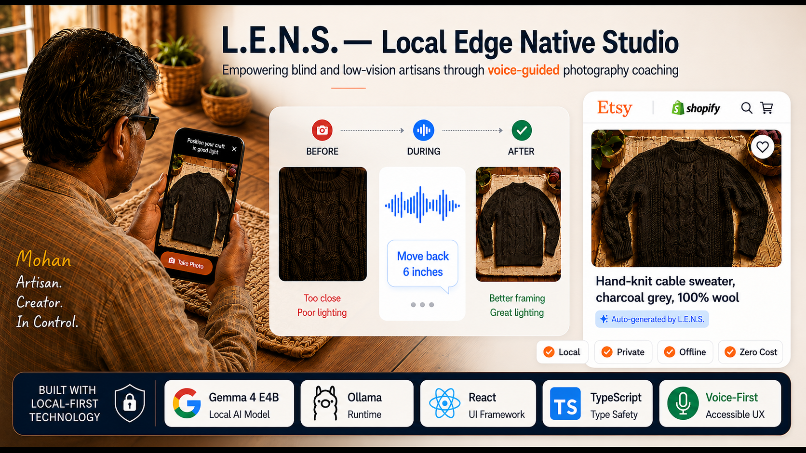
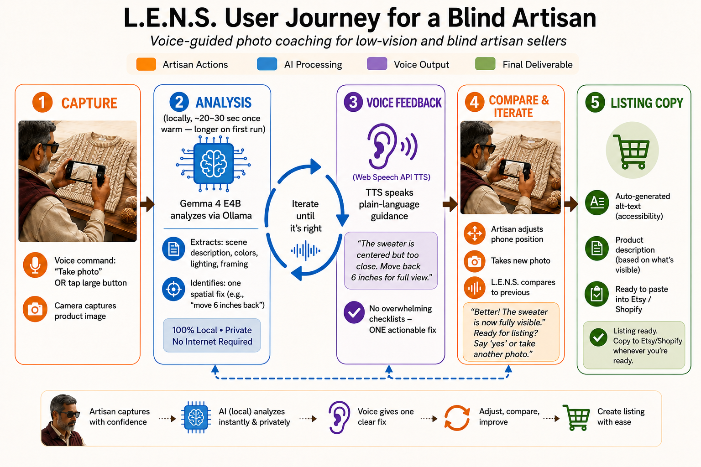
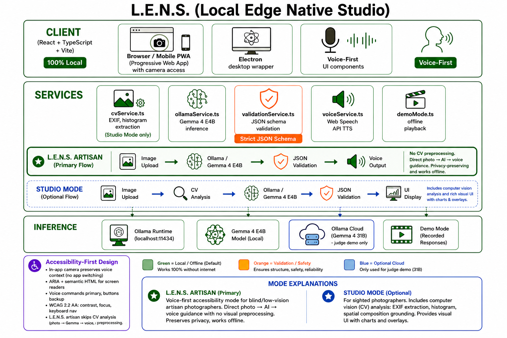
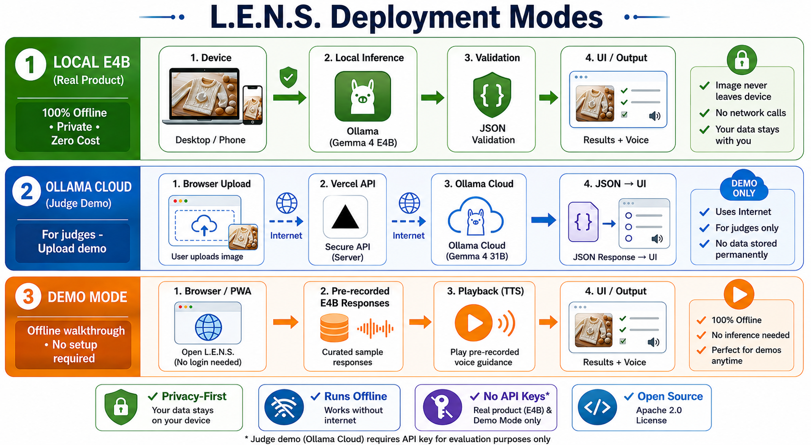
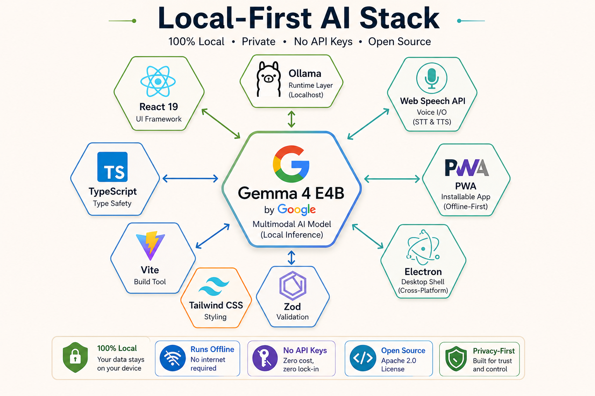

# 📷 L.E.N.S. — Local Edge Native Studio

> *The one step between a finished piece and a sale shouldn't depend on someone else's eyes.*

**A private, voice-guided photography coach for blind and low-vision artisans.**



[](https://ollama.com/library)
[](https://ollama.com)
[](https://react.dev)
[](https://www.typescriptlang.org)
[](LICENSE)

🔗 **Live demos:** [Judge try-it](https://lens-app-gemma4.vercel.app) (Ollama Cloud 31B) · [Real product / video](https://photography-coach-gemma4.vercel.app) (local E4B) · **Demo video:** _add link before submission_ · Built for the **Gemma 4 Good Hackathon**

**Tracks:** Digital Equity & Inclusivity · Ollama

---

## What L.E.N.S. is

Mohan has low vision. He hand-knits sweaters and can finish a flawless cable pattern by touch. He can shape, price, and list a piece on his own — until the one step he cannot finish alone: photographing it well enough to sell online.

**L.E.N.S. closes that gap.** It is a voice-guided photography coach that helps blind and low-vision artisans *verify and improve their product photos before listing their work*. It runs Gemma 4 through Ollama, describes the photo in plain language, names the single most useful fix, and returns alt-text and listing copy ready to paste.

The point isn't a sharper critique than a sighted friend would give — it's that Mohan no longer has to ask. The villain here is **dependence**, not blindness. Today a low-vision maker hires a photographer, waits for a sighted relative, or sends the image to a remote describer. L.E.N.S. removes the intermediary.

---

## Who it's for

Blindness is a spectrum — only an estimated 10–15% of blind and low-vision people have no light perception; the majority retain usable residual vision. Mohan is in that majority: he can frame a shot roughly and operate a phone, but cannot *verify* whether the light is even, the texture sharp, the colour true.

L.E.N.S. is built for that maker first. By the curb-cut effect it then generalizes outward — the same coaching helps any maker who lacks a photographer or a reliable connection — but the design target is always the hardest case: a blind maker, alone, offline.

---

## What it does

### 🎙️ Artisan Studio — the core experience

L.E.N.S. is built **voice-first**, not a visual interface with audio bolted on. The maker photographs a piece, and L.E.N.S. responds like a patient studio mentor — out loud, one priority at a time. For each photo it returns five things:

- **Plain-language scene description** — subject, framing, background, lighting.
- **Colour confirmation** — names the colours it sees, anchored to familiar references, so the maker can check the photo against the real object.
- **One spatial fix** — the single highest-impact change, never an overwhelming checklist.
- **Alt-text** — ready to paste, for the maker's own screen-reader customers.
- **Listing copy** — a short, accurate title and description grounded only in what the photo shows.

Three design choices make this work for a maker who works largely by ear:

- **One fix at a time.** A list of ten corrections is not actionable. The maker hears one change, re-shoots, and L.E.N.S. **compares** the new photo against the first to confirm the fix landed — a closing loop, not an open-ended critique.
- **Glass-box reasoning.** L.E.N.S. says *why* it flagged something, so the maker learns to photograph rather than just gets graded.
- **Anti-hallucination.** It states what it cannot see rather than inventing detail — which matters most precisely because the user cannot visually check the claims.

### 📸 Photo Studio — secondary

A general critique surface for sighted photographers: 5-axis scoring (composition, lighting, technique, creativity, subject impact), spatial bounding-box annotations, deterministic CV grounding (EXIF, histogram, focus map), a mentor chat, and Lightroom XMP sidecar export. An optional AI image-enhancement panel uses the Gemini API with the user's *own* key — clearly separate from the on-device coaching path.

---

## How it runs — three honest modes

L.E.N.S. runs Gemma 4 through **Ollama**, and is honest about where inference happens:

| Mode | What it is | Network |
|------|-----------|---------|
| **Local — Gemma 4 E4B via Ollama** | The actual product. Runs on the maker's own machine; the image never leaves the machine. | Fully offline |
| **Ollama Cloud (judge demo only)** | Powers **[lens-app-gemma4.vercel.app](https://lens-app-gemma4.vercel.app)** so judges can upload a photo without a local install. Uses **Gemma 4 31B** on [Ollama Cloud](https://ollama.com) (E4B is not hosted there). | Requires a connection |
| **Demo Mode** | Offline playback of real, previously recorded E4B responses — a no-setup walkthrough. | None |

**On-device E4B is the product; the judge deploy is how reviewers try uploads quickly.** The **lens-app** demo is labelled honestly: **sample photos** play back real E4B runs recorded on a local Mac; **uploads** use **Ollama Cloud** (`gemma4:31b`). The **photography-coach** deploy is the real-product / video build and does **not** send photos to Ollama Cloud. Opening the product Vercel URL alone does **not** run E4B in the browser — **Ollama must be running on your Mac** (same Wi‑Fi or a tunnel; see below). Every mode targets the **same strict JSON contract**, validated on the client so a malformed response fails loudly instead of degrading silently.

### Two public deployments (one repo)

| URL | Model | Experience |
|-----|-------|------------|
| **[photography-coach-gemma4.vercel.app](https://photography-coach-gemma4.vercel.app)** | **Gemma 4 E4B** (local) | Real product / submission video. Desktop: Ollama on the maker's Mac, fully offline. Phone: PWA reaches that **same local E4B** (same Wi‑Fi or a `cloudflared` tunnel to port 11434 — see [Try it on a phone](#-try-it-on-a-phone)). Boots into the **voice-guided Artisan journey**. |
| **[lens-app-gemma4.vercel.app](https://lens-app-gemma4.vercel.app)** | **Gemma 4 31B** (Ollama Cloud) | Judge try-it. Home → **Enter Artisan Studio** → sample grid (recorded E4B) or upload (cloud **31B**) → optional voice-guided journey. |

**Vercel env — judge project (`lens-app-gemma4`):** `VITE_DEPLOYMENT_PROFILE=judge` · `OLLAMA_API_KEY` · `OLLAMA_TARGET=cloud` · `OLLAMA_CLOUD_MODEL=gemma4:31b` — then redeploy. **E4B is local-only:** `ollama pull gemma4:e4b` on the Mac used for samples and for the real-product path.

> **Why E4B?** Gemma 4's E4B variant is small enough to run on a maker's own laptop through Ollama — and that on-device capability is the whole point: private, offline, free coaching. Larger Gemma 4 variants give sharper critique but cannot run locally on modest hardware.

Gemma is a trademark of Google LLC.

---

## 🚀 Quick start

**Prerequisites:** Node.js 18+ and npm · [Ollama](https://ollama.com) for local inference.

```bash
# 1. Clone
git clone https://github.com/prasadt1/photography-coach-gemma4.git
cd photography-coach-gemma4

# 2. Install dependencies
npm install

# 3. Pull the Gemma 4 model
ollama pull gemma4:e4b

# 4. Start Ollama
ollama serve

# 5. Run the app
npm start
```

Open **http://localhost:3000** (Vite may use **3001** or **3002** if 3000 is busy — check the terminal), capture or upload a photo, and L.E.N.S. coaches you through it.

> Prefer to skip setup? Open the **[judge try-it demo](https://lens-app-gemma4.vercel.app)** — samples (recorded local E4B) + upload (Ollama Cloud **31B**), no install required.

---

## 📱 Try it on a phone

The app is an installable PWA. Which backend you hit depends on **which deploy** you open:

| Deploy | Phone inference |
|--------|-----------------|
| **[photography-coach-gemma4.vercel.app](https://photography-coach-gemma4.vercel.app)** (real product / video) | **Gemma 4 E4B on your Mac** — the PWA talks to Ollama on the machine running the model, not Ollama Cloud. Same Wi‑Fi: `OLLAMA_HOST=0.0.0.0:11434 ollama serve` (see [docs/ios-pwa-setup.md](docs/ios-pwa-setup.md)). Off-LAN demo: `cloudflared tunnel --url http://127.0.0.1:11434` on the Mac while Ollama serves E4B. |
| **[lens-app-gemma4.vercel.app](https://lens-app-gemma4.vercel.app)** (judge demo) | **Ollama Cloud — Gemma 4 31B** for live uploads; samples are recorded E4B from a local Mac. |

### Same Wi‑Fi demo / video (HTTPS on LAN)

Safari requires **HTTPS** for the in-app camera on a LAN IP. On your Mac:

```bash
# Terminal 1 — Ollama reachable from the phone
OLLAMA_ORIGINS="*" OLLAMA_HOST=0.0.0.0:11434 ollama serve

# Terminal 2 — once per machine (trusted cert on iPhone): npm run setup:https
npm run start:https
```

Open the **Network** URL Vite prints (e.g. `https://192.168.x.x:3000`, or **3001** if 3000 is busy). Install the mkcert root on iPhone when prompted — see [scripts/setup-dev-https.sh](scripts/setup-dev-https.sh). The dev server proxies `/ollama` → `127.0.0.1:11434` so the phone never hits mixed-content errors.

**Demo video on LAN:** HTTPS on a LAN IP (or `?record=1` / `?skipConsent=1`) uses a **tap + voice-coaching** flow — welcome → **Start** → spoken hints, then large **Take Photo** / **Take another photo** / **Continue to listing** / **Copy listing** buttons (no speech recognition). Example: `https://192.168.x.x:3000/?record=1`.

**Install (hosted deploy or LAN URL):**

1. Open the URL in **Safari** on iPhone.
2. Share → **Add to Home Screen**, then launch full-screen.
3. Grant camera permission once. On the **LAN / `?record=1` demo path**, use the labelled buttons; **voice coaching (TTS)** guides each step. The standard journey still offers optional voice commands where the browser allows.

On-device inference **on the phone itself** (LiteRT native) is Phase 2 — see [Spike 3](docs/spikes/spike-3-litert-ios.md). Judge deploy env vars: table under [Two public deployments](#two-public-deployments-one-repo).

---

## 📊 Diagrams

High-level visuals (also used in the Kaggle writeup). Source files live in [`docs/images/`](docs/images/) (including `cover.png`).

### Artisan journey

Voice-guided flow: capture → local analysis → one spoken fix → compare → listing copy.



### System architecture

Client, services, and inference paths (Artisan vs Studio). Green = local; blue = judge cloud only.



### Three deployment modes

Local E4B (product), Ollama Cloud 31B (judge uploads), Demo Mode (recorded E4B samples).



### Tech stack



---

## 📐 Architecture

- **Strict JSON contract.** One structured object drives all five outputs; the client validates every response.
- **Principles-led prompt.** Gemma is driven by a system prompt that asks for explicit observations, reasoning, and a single prioritized fix.
- **Deterministic CV grounding** (Photo Studio): EXIF, histogram, and focus-map data are extracted client-side and passed alongside the image.
- **Desktop Vault Mode** (Electron): OS-level network isolation and an audit log, for makers who want a guaranteed-offline build.

---

## 🔬 Engineering spikes

Every runtime decision came from a time-boxed spike. Full results are in the repo:

- **[Spike 1 — Gemma 4 E4B via Ollama](https://github.com/prasadt1/photography-coach-gemma4/blob/main/spike/spike-1-results.md)** — validated structured output (Ollama's `format` field enforces a full JSON Schema at the token level) and surfaced the latency problem (~22–40s warm, 60–80s cold) plus the fixes: prompt tuning, a token cap, model warm-up on startup, streaming.
- **[Spike 2 — Cactus](https://github.com/prasadt1/photography-coach-gemma4/blob/main/spike/spike-2-results.md)** — evaluated and dropped: Cactus is mobile-only (no web/Node SDK) and its hybrid cloud routing conflicts with the local-only guarantee.
- **[Spike 3 — LiteRT on iOS](https://github.com/prasadt1/photography-coach-gemma4/blob/main/docs/spikes/spike-3-litert-ios.md)** — true on-device iOS is viable (~25 tok/s on a recent iPhone); the blocker is C++/Swift integration effort, so phone-native is Phase 2.
- **[llama.cpp & quantization study](https://github.com/prasadt1/photography-coach-gemma4/blob/main/docs/benchmarks/llama-cpp-quantization-study.md)** — why Q4_K_M over Q5/Q8, and why Ollama (which runs llama.cpp internally) over a raw llama.cpp binary.

---

## ♿ Accessibility

Because the users are blind and low-vision, accessibility is part of the build, not bolted on:

- **Voice-first by design.** Every voice action has an equal, clearly labelled tap — the app never depends on either input alone.
- **Screen-reader support.** Semantic landmarks, ARIA live regions for results and status, managed focus, and labelled controls; the app's own voice coaching sits *alongside* a screen reader, not in place of it.
- **Operable without a mouse.** Full keyboard operation with visible focus indicators.
- **Respects user preferences.** Honours `prefers-reduced-motion`; pinch-zoom is never disabled.
- **Contrast.** Targets WCAG 2.2 AA for text.
- **Multilingual.** UI and coaching available in several languages.

> Accessibility is a moving target — verify with an automated scan (axe / Lighthouse) and a real screen-reader pass before each release.

---

## 📦 Platform setup

**Web (Vite + React)**
```bash
npm start         # dev server → http://localhost:3000
npm run start:https  # LAN HTTPS for iPhone camera (see Try it on a phone)
npm run build     # production build → dist/
npm run preview   # preview the production build
```

**Desktop (Electron + Vault Mode)** — a guaranteed-offline build with OS-level network isolation:
```bash
npm run electron:dev          # run in development
npm run electron:build:mac    # → .dmg
npm run electron:build:win    # → .exe
npm run electron:build:linux  # → .AppImage
```

**iOS PWA** — install from Safari (see *Try it on a phone* above). **Judge demo:** Ollama Cloud 31B. **Real product:** E4B on your Mac via LAN or `cloudflared`.

---

## 🗺️ Roadmap

L.E.N.S. is built for the hardest case today; the honest next steps are:

- **Phone-native Gemma** — true on-device inference on the phone via LiteRT. Proven viable in [Spike 3](https://github.com/prasadt1/photography-coach-gemma4/blob/main/docs/spikes/spike-3-litert-ios.md) (~25 tok/s on a recent iPhone); the remaining work is C++/Swift integration, not feasibility.
- **Direct publishing** — pushing the finished listing straight to Etsy and Shopify, so the maker never has to leave L.E.N.S.
- **Haptic framing feedback** — vibration cues for alignment, for capture without any audio at all.
- **Wider grounding** — more craft categories in the prompt's grounding examples and a broader screen-reader test matrix.

Nothing above is implied as present: the local desktop path works today; phone-native LiteRT is proven but not shipped in this submission.

---

## 🗂️ Project structure

```
photography-coach-gemma4/
├── App.tsx                    # Root app + view routing
├── components/                # UI — AnalysisResults, LiveCameraCapture,
│                              #      ArtisanJourney, SellMode, Header, …
├── services/
│   ├── ollamaService.ts       # Gemma 4 inference (local + Ollama Cloud)
│   ├── analysisOrchestrator.ts# Local → cloud → demo pipeline
│   ├── promptService.ts       # Principles-led system prompt
│   ├── validationService.ts   # JSON contract validation
│   ├── voiceCoach.ts          # Artisan TTS + voice commands
│   ├── voiceService.ts        # Studio voice helpers
│   └── (demo samples)         # src/data/demoResponses.ts + public/demo-samples/
├── api/analyze.ts             # Vercel serverless fn → Ollama Cloud
├── electron/                  # Desktop shell + Vault Mode
├── public/                    # PWA manifest + service worker + demo-samples/
├── types.v2.ts                # JSON schema types
└── docs/                      # Specs, spikes, diagrams (docs/images/)
```

---

## 🧪 Testing

```bash
npm test                 # unit tests
npm run test:integration # pipeline integration tests
npm run test:all         # everything
```

---

## 🔧 Troubleshooting

**"Ollama not found"**
```bash
ollama --version                      # is it installed?
curl http://localhost:11434/api/tags  # is it running?
ollama list | grep gemma              # is the model pulled?
ollama pull gemma4:e4b                # pull it if missing
```

**Slow first analysis** — the first request loads the model (cold start). Warm it up:
```bash
ollama run gemma4:e4b "ready"
```

**Hosted demo returns no analysis** — confirm `OLLAMA_API_KEY`, `OLLAMA_TARGET=cloud`, and a valid cloud model (`gemma4:31b` on [ollama.com/api/tags](https://ollama.com/api/tags)) on the **lens-app** Vercel project, then redeploy. For local E4B: `OLLAMA_TARGET=local vercel dev` after `ollama pull gemma4:e4b`. See `TROUBLESHOOTING.md` for more.

---

## 🛠️ Built with

Gemma 4 (Google) · Ollama · React 19 · TypeScript · Vite · Electron · Tailwind CSS

---

## 📄 License

Apache License 2.0 — see [LICENSE](LICENSE).

---

## 🔗 Links

- **Judge try-it:** https://lens-app-gemma4.vercel.app · **Real product / video:** https://photography-coach-gemma4.vercel.app
- **Demo video:** _add before submission_
- **Repository:** https://github.com/prasadt1/photography-coach-gemma4
- **Hackathon:** Gemma 4 Good

---

<div align="center">

**The competence the maker already brings to the craft — extended to the one step that used to require another pair of eyes.**

*L.E.N.S. — Local Edge Native Studio · Gemma 4 E4B via Ollama*

</div>
